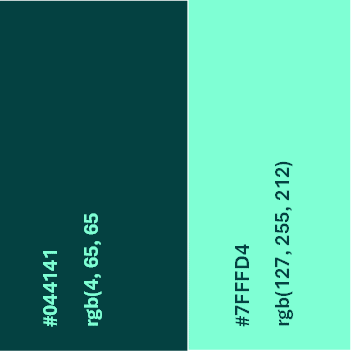
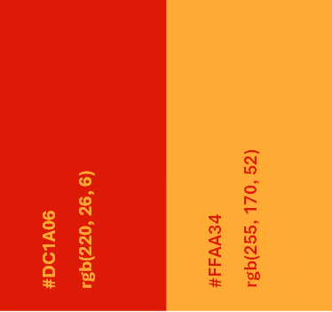
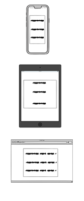
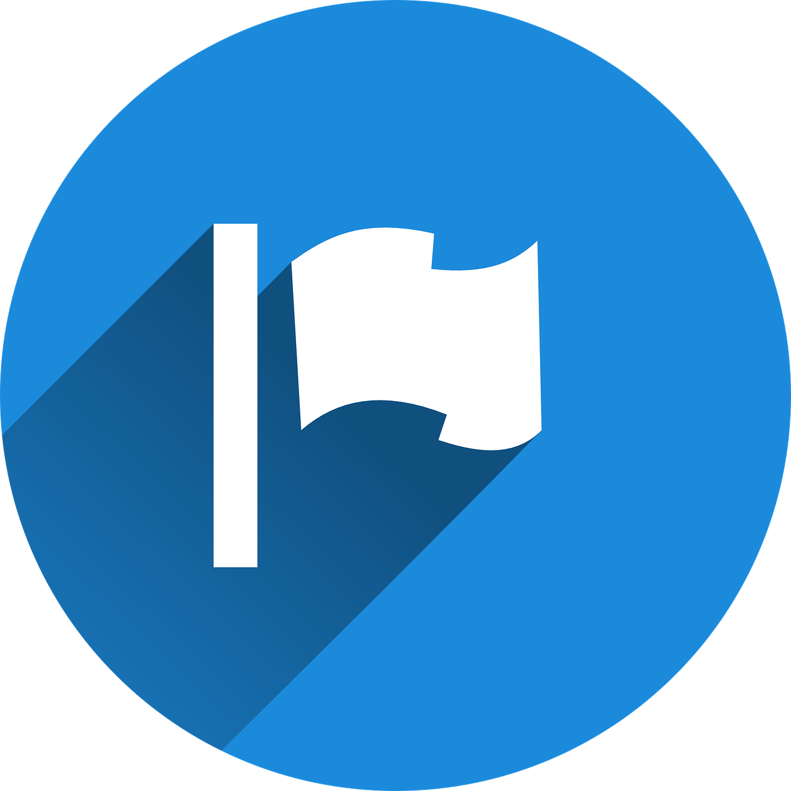
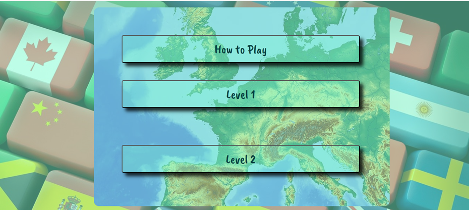
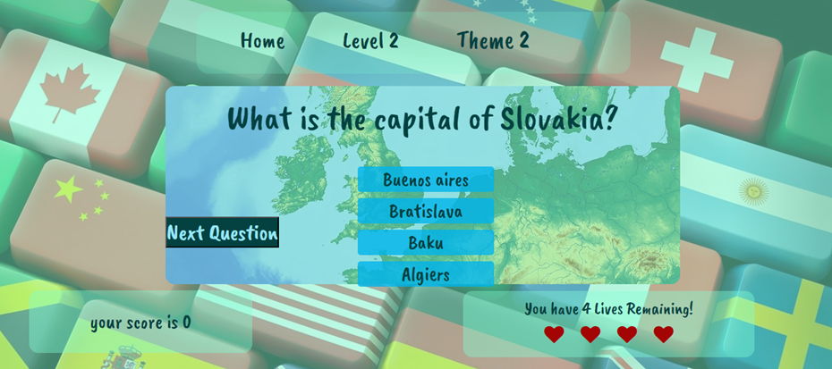
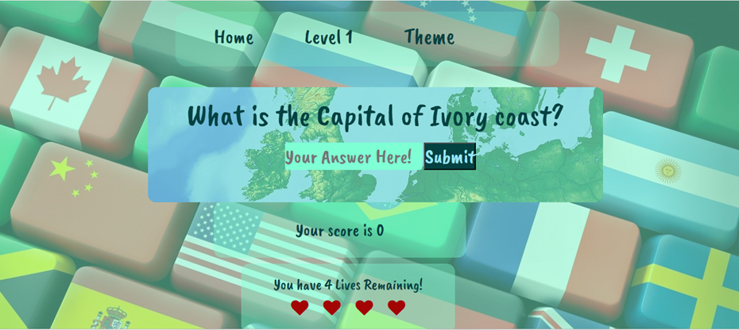

# Second Milestone Project

# What's the Capital

## Table of contents

- [Second Milestone Project](#second-milestone-project)
- [What's the Capita;](#whats-the-capital)
- [Table of Contents](#table-of-contents)
- [Project Rationale](#project-rationale)
- [User Experiance (UX)](#user-experience-ux)

## Project Rationale

* What's the Capital is a quiz game designed to help the user access and retain knowlege, of the Capitals of the world.
* As a teacher I have always found the best way for students to retain their learning, is with fun activities. A computer quiz game is a fun and interactive way to reach this goal.
* This project will help resolve the long and drawn process, of remembering the name of Capitals from the hundreds of Countries in th eworld.
* This project is unique as it offers two way of playing; 1. a multiple choice method 2. a chance for the user to type in his own answer. This is unique as it is a very efficient way to mprove the learning process.
* This project offers a quick and clear response to users answers quickly clarifying any doubts.
* This project has a wide scope offering quiz questions on over 200 Countries.
* This project is limited to the correct spelling of Capitals, in the write your own answer level.
* In summary the quiz is a vital piece of technology for anyonr intereted in learning the name of the world's Capitals. For those familiar with Capitals, this game wil be a vey fun way of testing their knowlege

## User Experience (UX)

### User Stories

#### First Time Visitor Goals

* I want to have easy access to a quiz on Coutries and their Capitals, to improve my geographic knowledge. I want to be able to play at any time, anywhere.
* I want the site to be responsive to my device.
* I want the site to be easy to navigate.
* I want clear response messages if my answer is correct.
* I want to be shown the correct answer if my answer is incorrect

#### Returning Visitor Goals

* I want to be able to choose a level of difficulty that I feel is appropriate for me, based on my experience from my first visit to the site.

#### Frequent Visitor Goals

* I want to be able to adjust the difficulty level to keep improving my knowledge.
* I want to be able to see my scores, to see how I am performing.

- - -

# Design

### Colour Scheme

I designed my colour scheme, based on the Project logo light blue. This also includes the blus from the map backgroung image of the game area.

- I have used `rgb(4, 65, 65)` for the dark text in the light background sections of the web pages.
- I have used `rgb(127, 255, 212)` for the light text in the dark background sections of the web pages.
- I have used `rgba(127, 255, 212, 0.5)` to give the images a more blue colour.
- I have used `rgb(220, 26, 6)` for the darker red text, in the red colour scheme.

#### Blue Color Scheme

#### Red Colur Scheme

### Typography

The entire Project uses the font "Caveat Brush", this is a fun font perfect to add some fun for the players. This font is from [google fonts](https://fonts.google.com/specimen/Caveat+Brush?query=caveat) and is linked at the top of each html file.

### Imagery

As the website is for Countries and their Capitals, I have used an intersting image for the hero image, of a keyboard with each key a different flag. This image as all the images on the website, is downloaded with a full license from [piaxabay](https://pixabay.com/photos/country-countryside-dales-england-21460/). The game area image is a satalite image of Europe and downloaded from [pixabay](https://pixabay.com/illustrations/map-cartography-relief-map-1804891/). The favicon logo is also downloaded from [Pixabay](https://pixabay.com/vectors/flag-violation-report-icon-1095057/)

### Wireframes

Wireframes were created for mobile, tablet and desktop using balsamiq.

#### Wireframes for home page

#### Wireframes for level 1 page

#### Wireframes for level 2 page

## What's the Capital Pages

### Features

The website is comprised of a home page, a level 1 page, a level 2 page, an error 404 page & an error 500 page.

All Pages on the website are responsive and have:

* A favicon in the browser tab.

  

#### The Home Page

The home page of What's the Capital is designed with a hero image of flags, in the center is a satalite image of Europe. Over the center image is the website menu consisting of; the how to play button, button linking to level 1 page and a button linking to level 2 page. The hoe to play button toggles when clicked and reveale the game instructions, it toggles back up when clicked again. 

#### Level 1 Page

After the user has clicked the level 1 button on the home page, the game will be loaded. The user will find the same background an design as th ehome page. On load the game wil display a question with four possible answers, the user will choose one of the four to click on. A correct answer will turn the box clicked on green and half a second later a message will appear confirming the users correct choice. Below the game area there is a score box, for each correct answer the user will recieve 1 point. If the box clicked is incorrect it will change to red, half a second later a message will appear pointing out to the user that the answer provided is incorrect, it will also show what the correct answer is. Below in the score box a point will be taken off,if the user has recived one the score will not go into minus. Beside the score box or below in mobile devices is the lives box. In the lives box, it dispalys the number of lives and four hearts, for every incorrect answer 1 life wil be removed. I fall four lives are lost the game will end. At the top of the page there are three nav buttons the first is a link back to the Home page, the second is a link to level 2 and the third called theme changes the colour scheme if the game from blue to red.

#### Level 2 Page

After the user has clicked the level 2 button on the home page, or the level 2 nav link on the level 1 page the second level will be loaded. The user will find the same background and design as the home and level 1 pages. On load the game wil display a question, there will be an input box where the user will type in an answer and click the submit button. A correct answer will load a message confirming the users correct answer. Below the game area there is a score box, for each correct answer the user will recieve 1 point. If the use types in the wrong answer message will appear, pointing out to the user that the answer provided is incorrect, it will also show what the correct answer is. Below in the score box a point will be taken off,if the user has recived one the score will not go into minus. Beside the score box or below in mobile devices is the lives box. In the lives box, it dispalys the number of lives and four hearts, for every incorrect answer 1 life wil be removed. If all four lives are lost the game will end. If the user submits without filing in the box or fills it with white spaces a message will load informing the user of an invalid inpu, the user will then be able to answer the quesiton properly. At the top of the page there are three nav buttons the first is a link back to the Home page, the second is a link to level 1 and the third called theme changes the colour scheme from blue to red.

#### Error pages
If a 404 or 500 error was to occur a custom page with a design consistent to the website will load, there will be  prompt and a link to send the user back to the home page.

- - -

### Accessibility

I have been mindful during coding to ensure that the website is as accessible friendly as possible. This has been have achieved by:

* Using semantic HTML.
* Using a hover state on all buttons on the site to make it clear to the user if they are hovering over a button.
* Choosing a sans serif font for the site - these fonts are suitable for people with dyslexia.
* Ensuring that there is a sufficient colour contrast throughout the site.

- - -

## Technologies Used

### Languages Used

HTML, CSS, JavaScript

### Frameworks, Libraries & Programs Used

* [JQUERY](https://jquery.com/) - Used to erite code for the  colour theme change and the how to play toggle

* [Balsamiq](https://balsamiq.com/) - Used to create wireframes.

* [Git](https://git-scm.com/) - For version control.

* [Github](https://github.com/) - To save and store the files for the website.

* [GitPod](https://gitpod.io/) - IDE used to create the site.

* [Google Fonts](https://fonts.google.com/) - To import the fonts used on the website.

* [Google Developer Tools](https://developers.google.com/web/tools) - To troubleshoot and test features, solve issues with responsiveness and styling.

* [Am I Responsive?](http://ami.responsivedesign.is/) To show the website image on a range of devices.

* [Web Disability Simulator](https://chrome.google.com/webstore/detail/web-disability-simulator/olioanlbgbpmdlgjnnampnnlohigkjla) - a google chrome extension that allows you to view your site as people with accessibility needs would see it.

* [Online Converter](https://www.online-convert.com/) To convert test imagery into gif files.

- - -

## Deployment & Local Development

### Deployment

The site is deployed using GitHub Pages - [Whats the Capital](https://e-h-dev.github.io/what-is-the-capital/index.html).

To Deploy the site using GitHub Pages:

1. Login (or signup) to Github.
2. Go to the repository for this project, [e-h-dev/what-is-the-capital](https://github.com/e-h-dev/what-is-the-capital)
3. Click the settings button.
4. Select pages in the left-hand navigation menu.
5. From the source dropdown select main branch and press save.
6. The site has now been deployed, please note that this process may take a few minutes before the site goes live.

### Local Development

#### How to Fork

To fork the repository:

1. Log in (or sign up) to Github.
2. Go to the repository for this project, [e-h-dev/what-is-the-capital](https://github.com/e-h-dev/what-is-the-capital)
3. Click the Fork button in the top right corner.

#### How to Clone

To clone the repository:

1. Log in (or sign up) to GitHub.
2. Go to the repository for this project, [e-h-dev/what-is-the-capital](https://github.com/e-h-dev/what-is-the-capital)
3. Click on the code button, select whether you would like to clone with HTTPS, SSH or GitHub CLI and copy the link shown.
4. Open the terminal in your code editor and change the current working directory to the location you want to use for the cloned directory.
5. Type 'git clone' into the terminal and then paste the link you copied in step 3. Press enter.

- - -

## Testing

Please refer to [TESTING.md](TESTING.md) file for all testing carried out.

## Credits

### Media

All the pictures through the pages of the website are downloaded with a license, from [Pixabay](https://pixabay.com/). Follow this [link](https://pixabay.com/service/terms/) to see the terms and conditions of downloads from pixabay.

### Acknowledgments

I would like to acknowledge the following people:

* Jabril Akolade - My Code Institute Mentor.

* Kera Cudmore - For the use of her amazing github repository [The quiz arms](https://github.com/kera-cudmore/TheQuizArms). Kera's repository was recommended to me by my mentor Jabril, to help with writing my documentation.

* Jessica Bessey - Of Newcastle College for helping in facilitating the course.

* Code institute - For all the help and well-structured lessons making this project possible after only three months of learning HTML.
