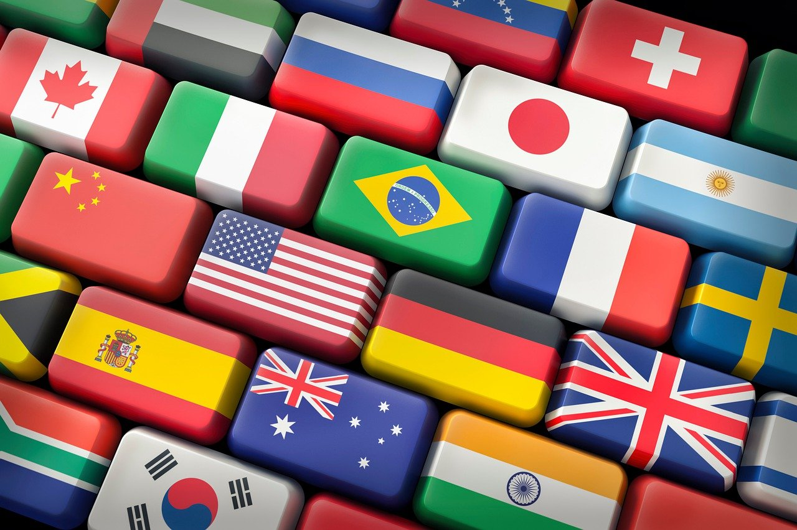

# Second Milestone Project

# What's the Capital

## Table of contents

- [Second Milestone Project](#second-milestone-project)
- [What's the Capita;](#whats-the-capital)
- [Table of Contents](#table-of-contents)
- [Project Rationale](#project-rationale)
- [User Experiance (UX)](#user-experience-ux)

## Project Rationale

* What's the Capital is a quiz game designed to help the user access and retain knowlege, of the Capitals of the world.
* As a teacher I have always found the best way for students to retain their learning, is with fun activities. A computer quiz game is a fun and interactive way to reach this goal.
* This project will help resolve the long and drawn process, of remembering the name of Capitals from the hundreds of Countries in th eworld.
* This project is unique as it offers two way of playing; 1. a multiple choice method 2. a chance for the user to type in his own answer. This is unique as it is a very efficient way to mprove the learning process.
* This project offers a quick and clear response to users answers quickly clarifying any doubts.
* This project has a wide scope offering quiz questions on over 200 Countries.
* This project is limited to the correct spelling of Capitals, in the write your own answer level.
* In summary the quiz is a vital piece of technology for anyonr intereted in learning the name of the world's Capitals. For those familiar with Capitals, this game wil be a vey fun way of testing their knowlege

## User Experience (UX)

### User Stories

#### First Time Visitor Goals

* I want to have easy access to a quiz on Coutries and their Capitals, to improve my geographic knowledge. I want to be able to play at any time, anywhere.
* I want the site to be responsive to my device.
* I want the site to be easy to navigate.
* I want clear response messages if my answer is correct.
* I want to be shown the correct answer if my answer is incorrect

#### Returning Visitor Goals

* I want to be able to choose a level of difficulty that I feel is appropriate for me, based on my experience from my first visit to the site.

#### Frequent Visitor Goals

* I want to be able to adjust the difficulty level to keep improving my knowledge.
* I want to be able to see my scores, to see how I am performing.

- - -

# Design

### Colour Scheme

I designed my colour scheme, based on the Project logo light blue. This also includes the blus from the map backgroung image of the game area.

- I have used `rgb(4, 65, 65)` for the dark text in the light background sections of the web pages.
- I have used `rgb(127, 255, 212)` for the light text in the dark background sections of the web pages.
- I have used `rgba(127, 255, 212, 0.5)` to give the images a more blue colour.
- I have used `rgb(220, 26, 6)` for the darker red text, in the red colour scheme.

### Typography

The entire Project uses the font "Caveat Brush", this is a fun font perfect to add some fun for the players. This font is from google fonts and is linked at the top of each html file.

### Imagery

As the website is for Countries and their Capitals, I have used an intersting image for the hero image, of a keyboard with each key a different flag. This image as all the images on the website, is downloaded with a full license from [piaxabay](https://pixabay.com/photos/country-countryside-dales-england-21460/). The game area image is a satalite image of Europe and downloaded from [pixabay](https://pixabay.com/illustrations/map-cartography-relief-map-1804891/). The favicon logo is also downloaded from [Pixabay](https://pixabay.com/vectors/flag-violation-report-icon-1095057/)

### Wireframes

Wireframes were created for mobile, tablet and desktop using balsamiq.