## Validation

### lighthouse 
* Each page has had a lighthouse test and passed 
 #### Lightnouse text images
 * Home page
 
 * Level 1
 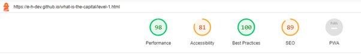
 * Level 2
 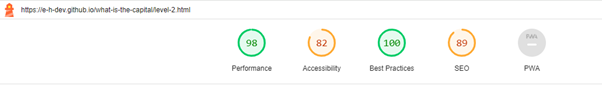

 ### w3c HTML checks
 * Home page
 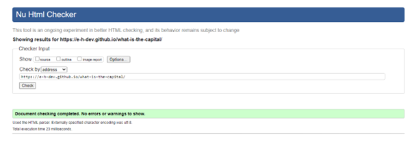
 * Level 1
 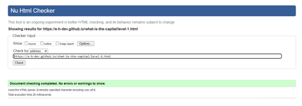
 * Level 2
 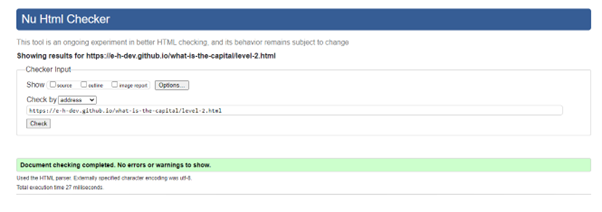

 ### jigsaw css check
 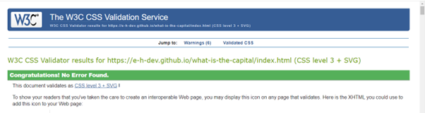

 ### Jshint Java Script test
 * My code was used with many ES6 java script syntax these were flagged as a warning by jshint.
 * No other warnongs were present.
 * Level 1
 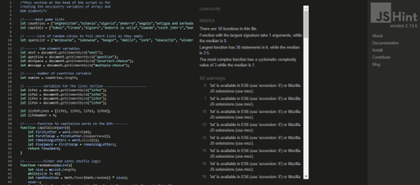
 * Level 2
 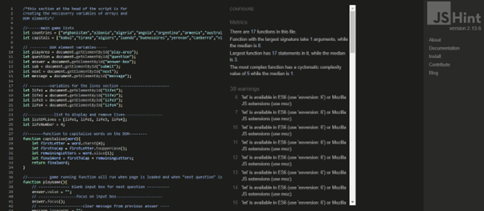
 

### Full Testing

Full testing was performed on the following devices:

* Laptop:
  * Lenovo
  * HP
* Mobile Devices:
  * Andriod Tablet

Each device tested the site using the following browsers:

* Google Chrome
* Microsoft Edge
* Opera

Additional testing was taken by friends and family on a variety of devices and screen sizes. They reported no issues when playing.

#### Manuel testing 

`Home Page`

| Feature | Expected Outcome | Testing Performed | Result | Pass/Fail |
| --- | --- | --- | --- | --- |
| How to play button | When clicked on it should toggle down and reveal game instructions | Clicked Button | Instructions toggle down | Pass |
| How to play button | Click on and instructions should toggle back up | Clicked on button | Instructions close | Pass |
| Level 1 button | Links to level-1.html | Clicked on Level 1 button | Level-1 page opened | Pass |
| Level 2 button | Links to level-2.html | Clicked on Level 2 button | Level-2 page opened | Pass |
| All buttons - hover effect | All buttons should expand when user hovers mouse over them. | Hover over each button on the page | Each button expands when hovered over | Pass |
| Cursor | The cursor should display as a pointer when a user moves the mouse over a button | Moved the mouse over each button to check the cursor changes upon entering the button | The cursor changed to the pointer cursor | Pass |

`Game playing tests`

#### Testing both levels for nav functionality

| Feature | Expected Outcome | Testing Performed | Result | Pass/Fail |
| --- | --- | --- | --- | --- |
|Home | Home link should link back to home page | Clicked on hme link | Home page loaded  | Pass |
| Level button | Both pages has a link to the other level they should load the other level when clicked | Clicked level navigation | New level loaded Pass |
| Theme | Should change colour of game to a orange color | Clicked on Theme button | The colors of the game change (image-1) | 

#### 1.
[Orange coloue scheme](assets/test-images/color-theme-2.png)

`Level-1 page`

#### Testing level 1 with shortened test list

| Feature | Expected Outcome | Testing Performed | Result | Pass/Fail |
| --- | --- | --- | --- | --- |
| Page loading | Four random answer options should appear | Loaded page | Four blue multiple choice answers appear under question (image 1) | Pass |
| Game run | None of the four options should be the same | Played the game twice till the end | All four answers were different efery time (image 1) | Pass |
| End of game | Game over message with score should display | Played the game twice till the end | Game over message with score were displayed (image 2) | Pass |
| Playing Game | Recieve a point for each correct answer | Played game entered correct answer | Score increased by a point (image3)| Pass |
| Playing Game | Correct message should display for correct answer | Played game entered correct answer | Correct answer message displayed (image 3)| Pass |
| Playing Game | Lose a point for each incorrect answer | Played game entered incorrect answer | Score decreased by a point | Pass |
| Playing Game | Incorrect message should display for incorrect answer | Played game entered incorrect answer | Incorrect answer message displayed (image 4)| Pass |
| Playing Game | One life should be removed for each incorrect answer | Played game entered incorrect answer | A life was removed (image 4) | Pass |
| Playing Game | Score count should not go below zero | Played game entered incorrect answer, when the score was at zero | Score remained zero (image 4) | Pass |
| Game over | After all four lives are removed the game should end | Played the game and entered many incorrect answers | after each incorrect answer a life was removed, when all 4 were removes the game over message was displayed (image 5) | Pass |
| Remove asked question | After a question is loaded to the DOM, the asked country should be removed from the list, not to repeat question in same game | I added a console.log for the countries list once before before the game runs, a second after the question is loaded | The list was one item shorter at the second console.log, it remove another item as the next question was loaded. (image 6) | Pass |
| Replace removed Capital on short list | The removed Capital from the answer must be replaced, or one of the multiple choice options will end up coming from an empty list, it will load is `undefined`. | I ceated a console.log of the short lists to show if the length of the lists remain long enough throuout the game. | The list always remained with at least three items, this removes the possibility of an option being loaded as `undefined` (image 6) | Pass |

 ### Supporting images for the above testing (each image has a referance number)

 #### 1.
 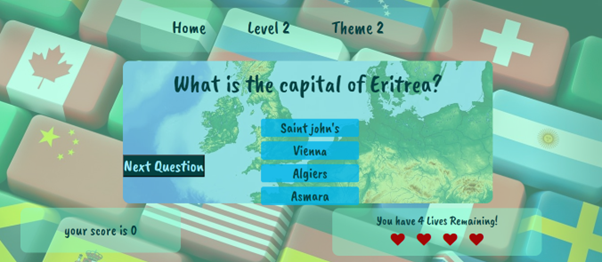

 #### 2.
 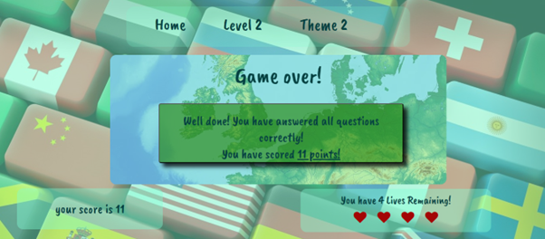

 #### 3.
 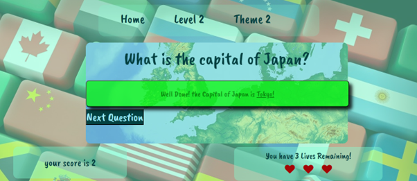

 #### 4.
 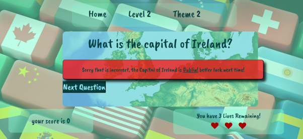

 #### 5.
 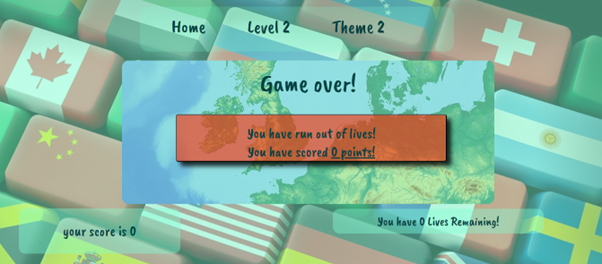

 #### 6.
 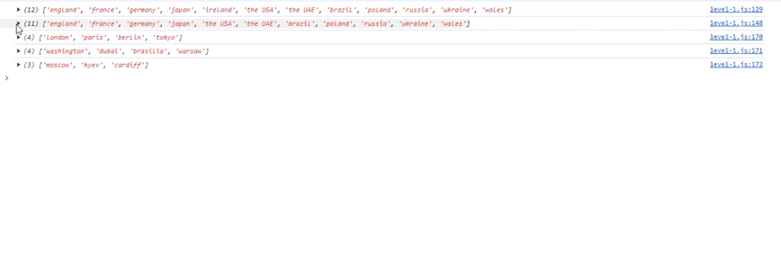

 `Level-2 page`

### Testing level 2 with shortened test list

| Feature | Expected Outcome | Testing Performed | Result | Pass/Fail |
| --- | --- | --- | --- | --- |
| End of game | Game over message with score should display | Played the game twice till the end | Game over message with score were displayed (image 1) | Pass |
| Playing Game | Recieve a point for each correct answer | Played game entered correct answer | Score increased by a point (image2)| Pass |
| Playing Game | Correct message should display for correct answer | Played game entered correct answer | Correct answer message displayed (image 2)| Pass |
| Playing Game | Lose a point for each incorrect answer | Played game entered incorrect answer | Score decreased by a point | Pass |
| Playing Game | Incorrect message should display for incorrect answer | Played game entered incorrect answer | Incorrect answer message displayed (image 3)| Pass |
| Playing Game | One life should be removed for each incorrect answer | Played game entered incorrect answer | A life was removed (image 3) | Pass |
| Playing Game | Score count should not go below zero | Played game entered incorrect answer, when the score was at zero | Score remained zero (image 3) | Pass |
| Game over | After all four lives are removed the game should end | Played the game and entered many incorrect answers | after each incorrect answer a life was removed, when all 4 were removes the game over message was displayed (image 4) | Pass |

### Supporting images for the above testing (each image has a referance number)

#### 1.
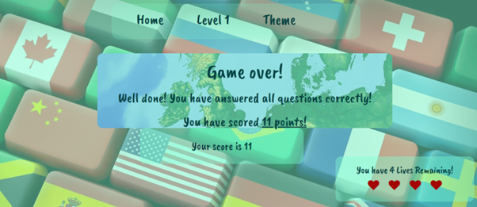

#### 2.
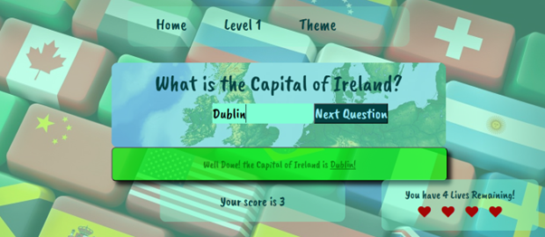

#### 3.
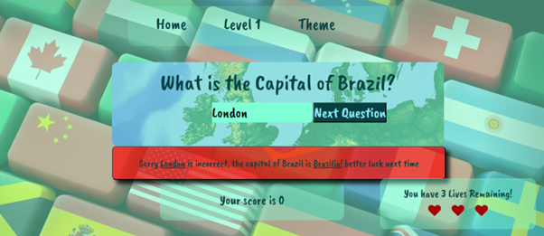

#### 4.
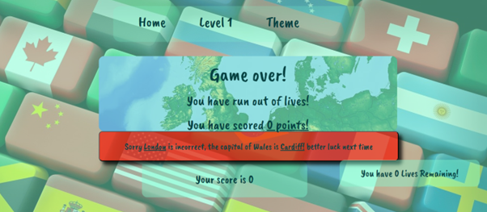