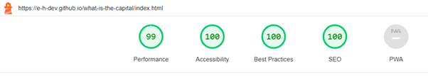
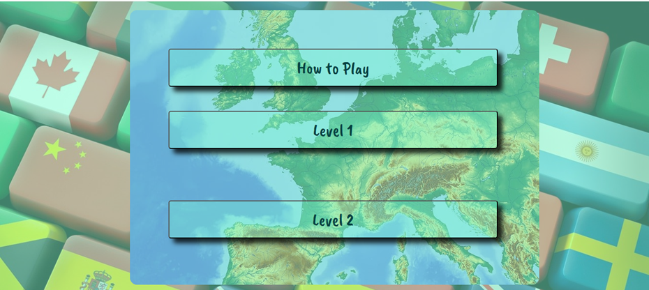
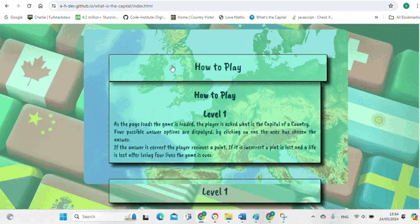

# What's the Capital Testing

Visit the deployed site: [What's the Capital Testing](https://e-h-dev.github.io/what-is-the-capital/)

- - -

## CONTENTS
* [Validation](#validation)
  * [Lighthouse](#lighthouse)
* [AUTOMATED TESTING](#automated-testing)
  * [w3c HTML checks](#w3c-html-checks)
  * [Jigsaw css check](#jigsaw-css-check)
  * [Jshint Java Script test](#jshint-java-script-test)
* [Testing User Stories](#testing-user-stories)
* [Full Testing](#full-testing)

Testing was ongoing throughout the entire build. I utilised Chrome developer tools, whilst building, to pinpoint and troubleshoot any issues as I went along.

During development, I made use of google developer tools to ensure everything was working correctly, and to assist with troubleshooting when things were not working as expected.

I have gone through each page using google chrome developer tools, to ensure that each page is responsive on a variety of different screen sizes and devices.

- - -

## Validation

### lighthouse 
* Each page has had a lighthouse test and passed 
 #### Lightnouse text images
 * Home page
 
 * Level 1
 
 * Level 2
 

 ## AUTOMATED TESTING

 ### w3c HTML checks
 * Home page
 
 * Level 1
 
 * Level 2
 

 ### Jigsaw css check
 

 ### Jshint Java Script test
 * My code was used with ES6 Javascript syntax. These were flagged as warnings by jshint.
 * No other warnings were present.
 * Level 1
 
 * Level 2
 
 
### Testing user stories

#### First Time Visitor Goals.

| REF | Goals | How are they achieved? |
| :--- | :--- | :--- |
| A | I want to have easy access to a quiz on Countries and Capitals, to improve my geographic knowledge. I want to be able to play at any time, anywhere. | What's the Capital is an easy to access website, it has clear instructions and it is easy to navigate. |
| B | I want the site to be responsive to my device. | With multiple media queries the website is responsive, over a range of devices. |
| C | I want the site to be easy to navigate. | With clear nav links which change when hovered over, the website is super easy to navigate round. |
| D | I want clear response messages if my answer is correct. | Half a second after a correct answer, a clear green message box appears. |
| E | I want to be shown the correct answer if my answer is incorrect. | If an answer is incorrect a message box comes on the screen, displaying the correct answer. |

#### User story gifs

* A

* B

* C

* D

* E

#### Returning Visitor Goals

| REF | Goals | How are they achieved? |
| :--- | :--- | :--- |
| F | I want to be able to choose a level of difficulty that I feel is appropriate for me, based on my experience from my first visit to the site. | At the home page and at the game pages, it is easy to navigate to a higher or lower playing level. |

* F

#### Frequent Visitor Goals

| REF | Goals | How are they achieved? |
| :--- | :--- | :--- |
| G | I want to be able to adjust the difficulty level to keep improving my knowledge. | After playing at level 1 and learning many new Capitals, the user can easily change to level 2, a more challenging aproach to the quiz. |
| H |I want to be able to see my scores, to see how I am performing. | The scores are clearly displayed below the game playing area. The score changes after each valid answer. |

* G
[Level choice](assets/user-story-checks/nav-check.gif)

* H
[Score show](assets/user-story-checks/score-show-check.gif)

### Full Testing

Full testing was performed on the following devices:

* Laptop:
  * Lenovo
  * HP
* Mobile Devices:
  * Android Tablet

Each device tested the site using the following browsers:

* Google Chrome
* Microsoft Edge
* Opera

Additional testing was taken by friends and family on a variety of devices and screen sizes. They reported no issues when playing.

#### Manuel testing 

`Home Page`

| Feature | Expected Outcome | Testing Performed | Result | Pass/Fail |
| --- | --- | --- | --- | --- |
| How to play button. | When clicked on, it should toggle down and reveal game instructions. | Clicked Button. | Instructions toggle down | Pass |
| How to play button. | Click on, and instructions should toggle back up. | Clicked on button. | Instructions close. | Pass |
| Level 1 button | Links to level-1.html. | Clicked on Level 1 button. | Level-1 page opened. | Pass |
| Level 2 button | Links to level-2.html. | Clicked on Level 2 button. | Level-2 page opened. | Pass |
| All buttons - hover effect | All buttons should expand when user hovers mouse over them. | Hover over each button on the page | Each button expands when hovered over. | Pass |
| Cursor | The cursor should display as a pointer when a user moves the mouse over a button. | Moved the mouse over each button to check the cursor changes upon entering the button. | The cursor changed to the pointer cursor. | Pass |

`Game playing tests`

#### Testing both levels for nav functionality

| Feature | Expected Outcome | Testing Performed | Result | Pass/Fail |
| --- | --- | --- | --- | --- |
|Home | Home link should link back to home page. | Clicked on home link. | Home page loaded.  | Pass |
| Level button | Both pages have a link to the other level. They should load the other level when clicked. | Clicked level navigation. | New level loaded. | Pass |
| Theme | Should change colour of game to a orange color. | Clicked on Theme button. | The colors of the game change. (image-1) | Pass

#### 1.

`Level-1 page`

#### Testing level 1 with shortened test list

| Feature | Expected Outcome | Testing Performed | Result | Pass/Fail |
| --- | --- | --- | --- | --- |
| Page loading | Four random answer options should appear. | Loaded page. | Four blue multiple choice answers appear under question (image 1) | Pass |
| Game run | None of the four options should be the same. | Played the game twice till the end | All four answers were different every time. (image 1) | Pass |
| End of game | Game over message with score should display. | Played the game twice untill the end. | Game over message with score was displayed. (image 2) | Pass |
| Playing Game | Receive a point for each correct answer. | Played game entered correct answer. | Score increased by a point. (image3)| Pass |
| Playing Game. | Correct message should display for correct answer. | Played game, and entered the correct answer. | Correct answer message displayed (image 3)| Pass |
| Playing Game | Lose a point for each incorrect answer | Played game, and entered the incorrect answer. | Score decreased by a point | Pass |
| Playing Game | Incorrect message should display for incorrect answer | Played game, and entered the incorrect answer. | Incorrect answer message displayed (image 4)| Pass |
| Playing Game | One life should be removed for each incorrect answer | Played game, and entered the incorrect answer. | A life was removed (image 4) | Pass |
| Playing Game | Score count should not go below zero | Played game, and entered the incorrect answer, when the score was at zero | Score remained zero (image 4) | Pass |
| Game over | After all four lives are removed the game should end | Played the game and entered many incorrect answers. | After each incorrect answer, a life was removed. When all 4 were removed, the game over message was displayed. (image 5) | Pass |
| Remove asked question. | After a question is loaded to the DOM, the asked country should be removed from the list, so as not to repeat question in same game. | I added a console.log for the countries list once before the game runs, and a second, after the question is loaded. | The list was one item shorter at the second console.log. It removed another item as the next question was loaded. (image 6) | Pass |
| Replace, removed Capital on short list. | The removed Capital from the answer must be replaced, or one of the multiple choice options will end up coming from an empty list. it will load as `undefined`. | I ceated a console.log of the short lists, to show if the length of the lists remain long enough throughout the game. | The list always remained with at least three items. This removed the possibility of an option being loaded as `undefined` (image 6) | Pass |

 ### Supporting images for the above testing (each image has a referance number)

 #### 1.
 

 #### 2.
 

 #### 3.
 

 #### 4.
 

 #### 5.
 

 #### 6.
 

 `Level-2 page`

### Testing level 2 with shortened test list

| Feature | Expected Outcome | Testing Performed | Result | Pass/Fail |
| --- | --- | --- | --- | --- |
| End of game | Game over message with score should display. | Played the game twice untill the end. | Game over message with score was displayed (image 1) | Pass |
| Playing Game | Received a point for each correct answer. | Played game and entered correct answer. | Score increased by a point (image2)| Pass |
| Playing Game | Correct message should display for correct answer |Played game and entered correct answer. | Correct answer message displayed. (image 2)| Pass |
| Playing Game | Lose a point for each incorrect answer | Played game and entered incorrect answer. | Score decreased by a point | Pass |
| Playing Game | Incorrect message should display for incorrect answer. | Played game and entered incorrect answer. | Incorrect answer message displayed. (image 3)| Pass |
| Playing Game | One life should be removed for each incorrect answer. | Played game entered incorrect answer. | A life was removed. (image 3) | Pass |
| Playing Game | Score count should not go below zero | Played game and entered incorrect answer, when the score was at zero. | Score remained zero (image 3) | Pass |
| Game over | After all four lives are removed the game should end. | Played the game and entered many incorrect answers. | After each incorrect answer, a life was removed. When all 4 were removed, the game over message was displayed (image 4) | Pass |

### Supporting images for the above testing (each image has a referance number)

#### 1.

#### 2.

#### 3.

#### 4.
